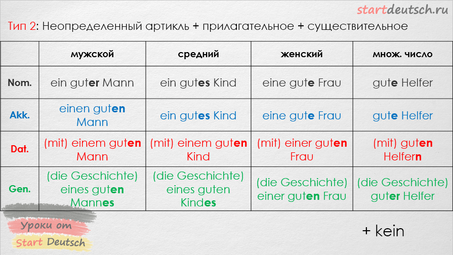

# der Kasus | der Fall (Падежи)

vier Kasus / Falle

<pre>

- Nominative    |   wer? was? (кто? что?)   |   аналог именительного. Роль подлежащего.     | без предлогов всегда
- Genetive      |   wessen? (чей?)          |   аналог родительного.                        | -s,-ss,-b,-x,-tz,-z --> (+es) иначе (+s) |  -nis --> -nises |  -is -as -us -->  +es
- Dativ         |   wem? (кому?)            |   аналог Дательного                           |
- Akkusativ     |   wen? was? (кого? что?)  |   аналог ВИнительного                         |
- Тварительный (нет)
- Предложный (нет)

Любое действие - это акусатив
Люая позиция - это датив

                                                                SUBSTANTIV

| nane     |    (pl)          |    (m)             |    (n)             |    (f)           |
| Nom.:    |    die Kinder    |    der Vater       |    das Kind        |    die Mutter    |
| Gen.:    |    der Kinder    |    des Vater(s)    |    des Kind(es)    |    der Mutter    |
| Dat.:    |    den Kinder(n) |    dem Vater       |    dem Kind        |    der Mutter    |
| Akk.:    |    die Kinder    |    den Vater       |    das Kind        |    die Mutter    |

| nane     |    (pl)          |    (m)             |    (n)             |    (f)           |
| Nom.:    |    Kinder        |    ein Vater       |    ein Kind        |    eine Mutter   |
| Gen.:    |    Kinder        |    eines Vater(s)  |    eines Kind(es)  |    einer Mutter  |
| Dat.:    |    Kinder(n)     |    einem Vater     |    einem Kind      |    einer Mutter  |
| Akk.:    |    Kinder        |    einen Vater     |    ein Kind        |    eine Mutter   |

| nane     |    (pl)          |    (m)             |    (n)             |    (f)           |
| Nom.:    |    die           |    der             |    das             |    die           |
| Gen.:    |    deren/derer   |    dessen          |    dessen          |    deren         | 
// deren указывает на предметы, названные ранее, а derer указывает на предметы, названные позже, в последующем придаточном предложении
| Dat.:    |    dem           |    dem             |    der             |    denen         |
| Akk.:    |    die           |    den             |    das             |    die           |

der Pilz (-es *, -e **) гриб 

Nom.:   der Pilz - Гриб 
Gen.:   des Pilzes - шляпка Гриба       <-- *
Dat.:   dem Pilz - ударить по Грибу
Akk.:   den Pilz - взять Гриб
plular: die Pilze                       <-- **
=

                                                               PRONOMEN
________________________________________________________________________________________________________________________________________________
|           |                    ед. число                                       ||                    мн. число                               |
|___________|____________________________________________________________________||____________________________________________________________|
| nane      |    1 лицо        |    2 лицо          |           3 лицо           ||    1 лицо        |    2 лицо          |    3 лицо          |
|           |                  |                    |____________________________||                  |                    |                    |
|           |       я          |     ты             |   он   |   она   |   оно   ||     мы           |      Вы (мн)       |        они(Вы)     |
|___________|__________________|____________________|________|_________|_________||__________________|____________________|____________________|
| Personal  |                  |                    |        |         |         ||                  |                    |                    |
| Nom.:     |    ich           |    dich            |   er   |   sie   |   es    ||    wir           |    ihr             |    sie             |
| Gen.:     |    meiner        |    deiner          | seiner |  ihrer  | seiner  ||   unserer        |    eurer           |    ihrer           |
| Dat.:     |    mir           |    dir             |   ihm  |   ihr   |  ihm    ||    uns           |    euch            |    ihnen           |
| Akk.:     |    mich          |    dich            |   ihn  |   sie   |   es    ||    uns           |    euch            |    sie             |
|___________|__________________|____________________|________|_________|_________||__________________|____________________|____________________|
| Possessiv |                  Possessivpronomen - меняются по падежм в зависимости от рода и числа.                                           |
|           |__________________________________________________________________________________________________________________________________|
|           |                  |                    |        |         |         ||                  |                    |                    |
| Муж.Ед.ч. |                  |                    |        |         |         ||                  |                    |                    |
| Nom.:     |       mein       |    dein            | sein   |  ihr    | sein    ||   unser          |    euer            |    ihr             |
|           |                  |                    |        |         |         ||                  |                    |                    |
|___________|__________________|____________________|________|_________|_________||__________________|____________________|____________________|
| Reflexive |                  |                    |                            ||                  |                    |                    |
| Dat.:     |    mir           |    dir             |          sich              ||    uns           |    euch            |    sich            |
| Akk.:     |    mich          |    dich            |          sich              ||    uns           |    euch            |    sich            |
|___________|__________________|____________________|____________________________||__________________|____________________|____________________|

</pre>

use Dative: `ab aus außer bei gegenüber mit nach seit von zu   - только датив прибавляй`
песня вальс: `aus außer bei mit` - `seit vor nach` - `von zu`

- mit (c, с помощью, на чем-то [mit dem Auto])
- nach 
    - темпоральное ( временное "после") nach dem Schule
    - локальное (только с названиями городов ) nach Russland / nach Deutschland - в Россию в Германию
- aus (из)
- zu (к): ich gehe zum Arzt .. zum == zu + dem
- von (от чего-то или от кого-то)  ich gehe von dem Arzt
- bei (при ком-то на чем-то) ich bin bei dem Arzt (я [сейчас] у врача)

use Accusative: `FUDOG`

- fu:r (для) ich arbeite fu:r meine Zukenft - я работаю для своего будущего
- um (вокруг) ich laufe um das Hasus
- durch (через | through )  ich sehe durch den Gat - я смотрю через отверстие
- ohne (без)
- gegen (против / against the wall)

## Deklination vo _Adjektiven (склонение прилагательных)

### Склонение главных глаголов

 

#### haben & sein & werden

### модальные

#### Durfen und Kennen

#### Mogen und wollen

#### Mussen und sollen

