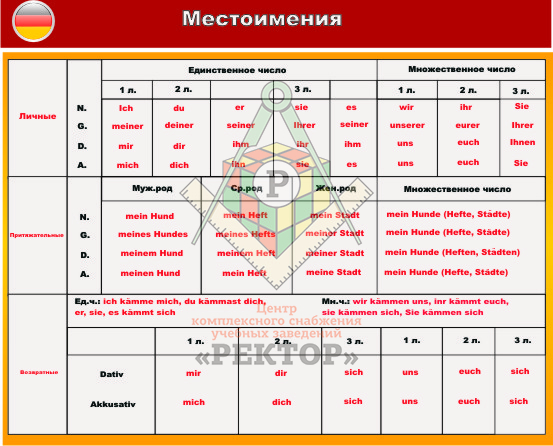

# Pronomen (Местоимения)

## 1. Личные
    - Nom. / Gen. / Dat. / Acc.
    - ich / meiner / mir / mich
    - du / deiner / dir / dich
    - er, sie, es / seiner, ihrer, seiner / ihm, ihr, ihm / ihn, sie, es
    - wir / unserer / uns / uns
    - ihr / euerer / euch / euch
    - sie, Sie / ihrer / ihnen / Sie
## 1*. Безличные
    - man (Hier kann man gut essen - здесь можно хорошо поесть) - "kann man" == "можно"
    
## 2. Возвратные 
    (себя – местоимение которое обозначает, что действие, совершаемое кем-то, направлено на само действующее лицо):

    - mir / mich
    - dir / dich
    - sich
    - uns
    - euch
    - sich

## 3. Притяжательные  (чей? чьё?) / (чья? чьи?) +[e]
    (мой, твой, наш, ваш, свой – указывают на признак предмета по его принадлежности):

    - mein
    - dein
    - sein, ihr, sein
    - unser
    - euer
    - ihr

## 4. Вопросительные 
    (кто? что? какой? чей? который? сколько? где? когда? куда? откуда? зачем? и другие – употребляются в вопросительных предложениях):

    - was, wer (wessen, wem, wen) = что, кто (чей, кому, кого)
    - wo = где
    - Wohin = куда
    - Woher = откуда
    - Wann, wenn = когда
    - Warum = почему
    - Wie = как
    - Welche = какой

## 5. Относительные 
    (совпадают с вопросительными – кто, что, какой, чей, который, сколько, где, когда, куда, откуда, зачем и другие, но употребляются не в роли вопросительных слов, а в роли союзных слов в придаточных предложениях):

    - dessen / deren
    - welcher

## 6. Указательные: (более точно указывают на лицо или предмет, чем определенный артикль, и употребляются вместо определенного артикля)
    (тот, этот, сей, оный, такой, столько, тут, здесь, туда, сюда, оттуда, отсюда, тогда, поэтому, затем и другие – это средства указания на определённые предметы, признаки, количество (с различением одного от другого)):

    - der (die, das) - тот (та, то) - употребляются как самостоятельное подлежащее или дополнение вместо отсутствующего существительного
    - der (die, das) + selbe - тот (же) самый - указывают на лицо или предмет, идентичные ранее названным
    - der (die, das) + jenige - тот (та, то) - указывают на лицо или предмет, о которых пойдет речь в последующем относительном придаточном предложении
    - dieser (diese, dieses) - этот (эта, это)
    - jener (jene, jenes) - тот (та, то) // Местоимения jener и dieser заменяют два существительных при сопоставлении двух лиц или предметов. Jener указывает на предмет, упомянутый первым, dieser указывает на предмет, упомянутый вторым.
    - Solcher (solche, solches) - такой (такая, такое) 
    - selbst - сам, сама, само. Указательное местоимение selbst (selber) не склоняется и не различается по родам
    
## 7. Определительные
    (сам, самый, весь, всякий, каждый, иной, другой, любой, всюду, везде и другие – служат средством уточнения того предмета, признака, о котором идёт речь):
    - alles (всё)
    - alle (все)

## 8. Отрицательные
    (никто, ничто, никакой, ничей, нисколько, негде, никогда, ниоткуда, незачем и другие – указывают на отсутствие предметов, признаков, количества):

    - keine (никакой)
    - niemand (никто)
    - nie (никогда:  never, at no time)
    - niemals (никогда: never ever, no way, not for a moment) - эмоционально
    - nimmer (никогда: no longer, no more)
    - nichts (ничего)

## 9. Неопределенные
    (некто, нечто, некий, какой-то, чей-нибудь, некоторый, несколько, сколько-либо, где-то, когда-либо, кое-куда, откуда-то, зачем-то и другие – указывают на неопределённые, неизвестные предметы, признаки, количество):

    - jemand (кто-то)
    - etwas (что-то)

 
 
 