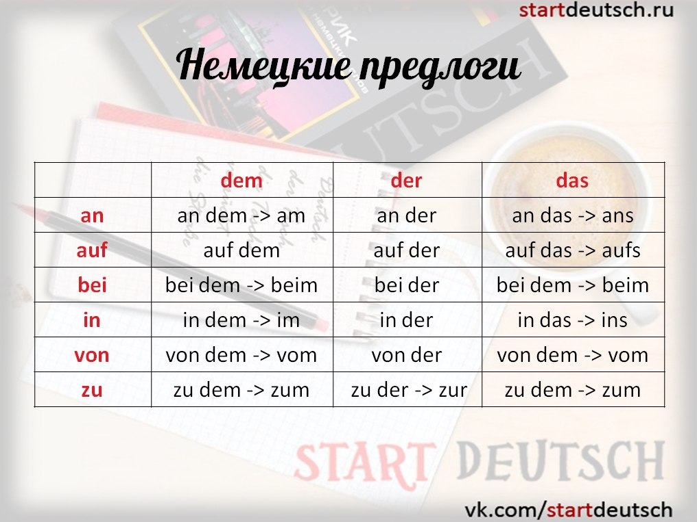
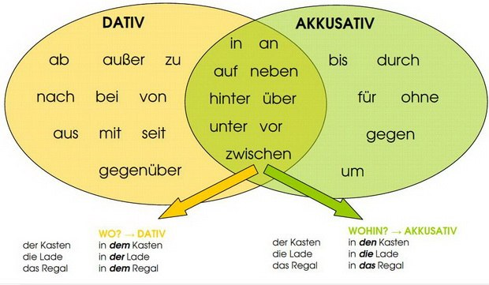
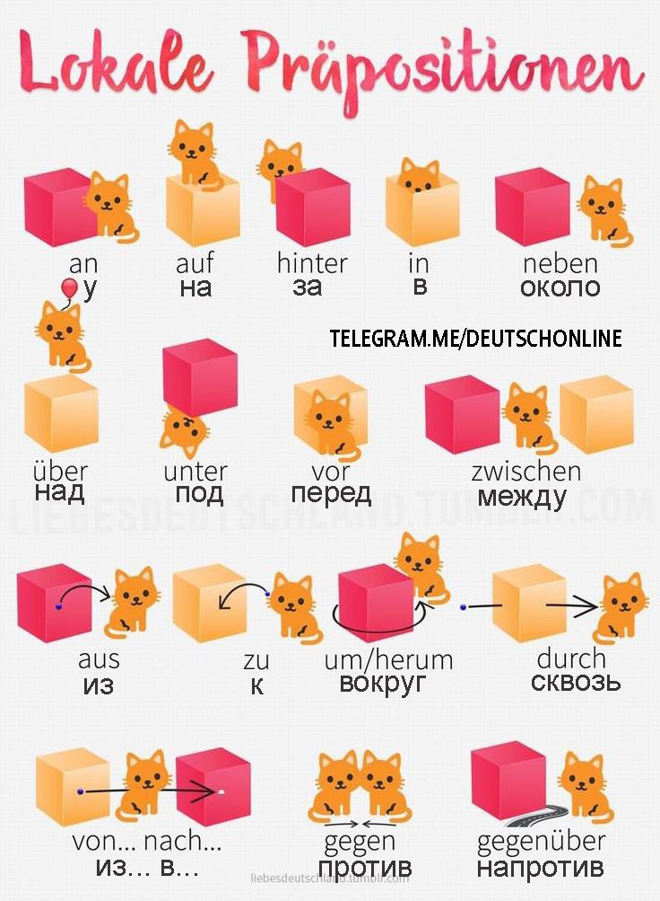

# Präposition (Предлог - Предлоги выражают зависимость существительных, числительных и местоимений от других частей речи в словосочетаниях, входящих в состав предложения.)

- nach (в == направляемся туда (geografic locations)) 
    * темпоральное ( временное "после" | after) nach dem Schule
    * локальное (только с названиями городов ) nach Russland / nach Deutschland - в Россию в Германию
- in (в .. means to go inside of building)
- zu (к .. means to go there (not geografic locations )): ich gehe zum Friseur || zum = zu + dem | zur = zu + der
- um (в - specific time: um ach Uhr (at 8:00 PM = at 20:00 ))
- im (в - Month, Season; весной летом зимой осенью: im Frühling im Sommer im Winter im Herbst)
- am (в - Date, Weekdat; предлог для числа месяца: ich fliege am fünften Oktober aus Russland  - я вылетаю 5-ого откебря из России)
- bei (в / при ich wohne bei meinen Eltern - я живу со своими родителями. at your place at wherever you are)
- ab (из/c from|stady): ab dem ersten September - с первого сентября
- aus (из == направление оттуда)
- außer (except for: alle sprechen Deutsch außer mir = все говорят по немецки кроме меня)
- von (из / от / об / from): ich kome vom Friseur - я пришел из парикхмахерской  || vom = von + dem
- auf (на) 
    * dativ: Das Buch liegt auf dem Tisch - книга лежит на столе
    * akusativ: Ich stelle die Vase auf den Boden - я ставлю вазу на пол
- an (на / за / у) 
    * dativ: Das Bild hängt an der Wang - картина вести на стене
    * akusativ: ich gehe an die Tafel - я иду к доске
    * akusativ: ich schreibe an die Tafel - я пишу на доске (я пишу куда? на доску)
    * Wir sitzen am Tisch - мы сидим за столом
    * Ich sitze am Fenster - я сижу у окна
- mit (с )
- für (для)
- durch (по / благодаря)
- über (о)
- ohne (без)
- gegen (против -  Он проголосовал ПРОТИВ меня)
- gegenüber (напротив - они хорошо расположены ко мне. opposite from|of )
- seit (в течении, уже, since/for) : ich wohne seit einem Jahr in Bangkok (PRESENT PERFECT CONTINUOUS in english)
- vor (перед, тому назад, ago)
    * some time point in the past (Vor einem Jahr hat sie geheiratet - she merried one year ago)
    * также применяется со смыслом замены английского `of` на немецкий `vor`: Angst haben `vor` etwas = to be scared `of` something

für mich 
du machst es für mich
ich gehe zu dir
über dich (о тебе)

