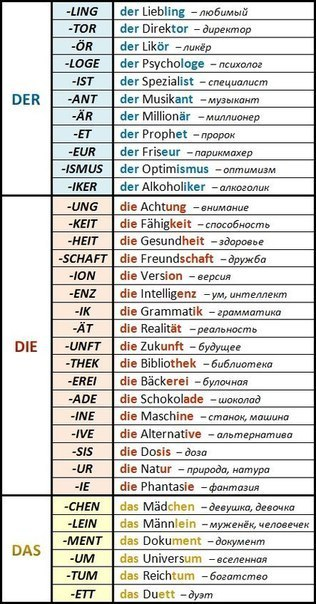

## DER: ( -ig -ling -ismus -er -ich -us )
1. -er -ling
2. профессии: -ant -ent -ist -loge -eur -a:r -or
3. производные от глаголов (односложные) Der Lauf (laufern)
4. Название сезона года
5. Название месяца
6. Название дней недели
7. части суток (кроме die Nacht)
8. спиртные напитки чай кофе сок
9. -ig -ling -ismus -er -ich -us

## DIE: ( -heit -ung -keit -ei -schaft -tion -ta:t -ik )
1. -in
2. -e (не обозначающее мужского лица явно)
3. чилительные ставшие существительным
4. деревья цветы 
5. название рек
6. -heit -ung -keit -ei -schaft -tion -ta:t -ik

## DAS: ( -um, -chen, -ma, -ment, -lein )
1. -chen -lein (уменьшительно-ласкательное)
2. ge-
3. субстантивированные глаголы (глагол превратился в существительное)
4. название гостиниц кино 
5. металлы и хим элементы
6. цвет, название языков, букв, нот и физических едениц
7. название континентов городов и стран - если применяются с прилагательным

