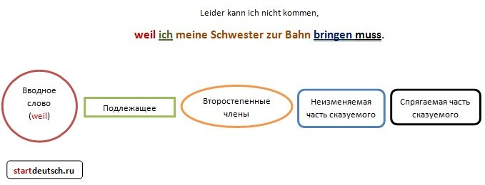
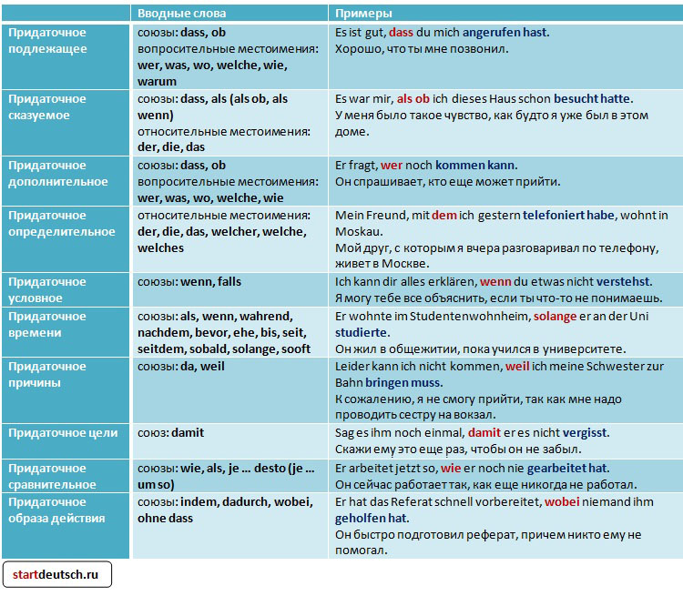
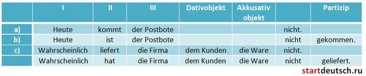
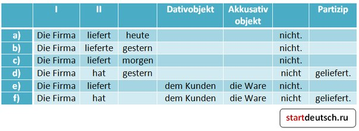
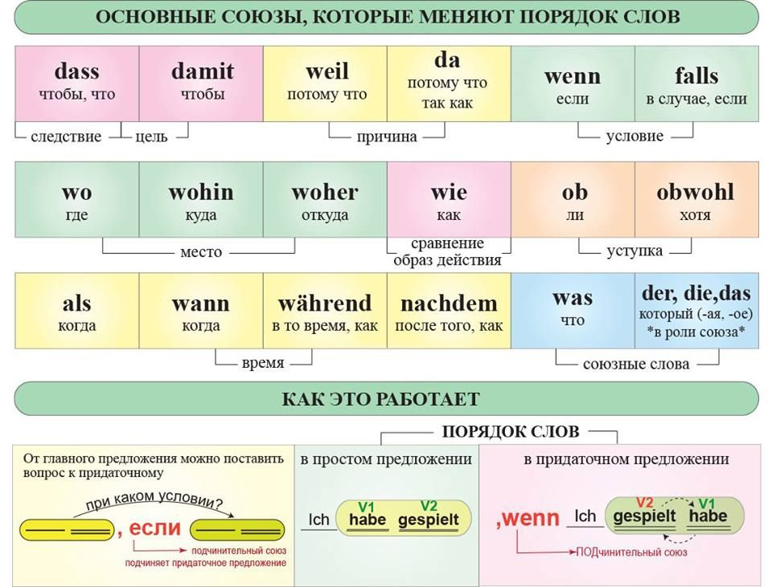

# Wortreihenfolge (Порядок слов)

В придаточном предложении сказуемое стоит на последнем месте. Если сказуемое составное, то спрягаемая часть стоит на самом последнем месте, а неизменяемая - перед ней. Отрицание «nicht» стоит перед сказуемым. Отделяемые приставки не отделяются. Подлежащее стоит сразу за союзом.

## Обратный порядок слов

Смысл предложения в результате инверсии практически не меняется, при этом I место связывает предложение по смыслу с предыдущим высказыванием и подчеркивает продолжение действия

1. Союзы которые не меняют порядок слов в предложении: `und, denn, sondern, aber и oder`
    - und (и:  ich mag kein Hunde und ich mag Katzen)
    - denn (так как, потому что:  ich mag kein Hunde denn ich mag Katzen) // vs weil: denn is more common when the causality is less necessary, and the point of the clause is to introduce helpful, but possibly more parenthetical information.
    - sondern (но - в значении "скорее"/"but rather":  ich mag kein Hunde sondern ich mag Katzen )
    - aber (но:  ich mag Hunde aber ich mag kein Katzen)
    - oder (или)

2. Союзы ко торые меняют порядок слов (они "выгоняют" сказуемое в конец предложения): `während, bis, als, wenn, da, weil, ob, obwohl и dass`
    - während (в то время как, пока, между тем как, тогда какб)
    - bis (в, пока, до тех пор как)
    - als (чем, нежели, как, когда, в качестве, в то время как)
    - wenn (когда, если)
    - da (потому что, так как, поскольку, тогда, когда)
    - weil (ибо, потому что, так как) // vs denn: Weil, by contrast, tends to imply a more strictly necessary condition.
    - ob (ли)
    - obwohl (хотя, несмотря на то что])
    - dass (что, чтобы)

3. Если есть модальный глагол, то инфинтив смыслового глагола уходит в конец предложения.

4. TeKaMoLo = Temporal, Kasual, Modal, Lokal - Когда? Почему? Как? Где?
    - Ich ging gestern gelangweilt in die Uni. - Я шёл (когда?) вчера (как?) скучая (куда/где?) в университет.

    - Если в предложении оба дополнения выражены существительными, то сначала идет дополнение в Dativ, затем в Akkusativ: Ich gebe meinem Bruder ein Geschenk.

    - Если одно из дополнений выражено местоимением, оно ставится перед дополнением, выраженным существительным: Ich gebe ihm ein Geschenk.

    Или: Ich gebe es meinem Bruder.

    - Но если в предложении оба дополнения выражены местоимениями, то порядок меняется: сначала Akkusativ, потом Dativ. Например, Ich gebe es ihm.  

Subject = `color`

| Name Pos. 1   | Position 1    | Position 2 | Rest                                     |
|:-:|:-:|:-:|:-:|
| Subject       | `Hans`        | fährt      | heute seine Tochter schell in die Schule |
| Pronoun       | `Er`          | fährt      | heute seine Tochter schell in die Schule |
| Time          | Heute         | fährt      | `er` seine Tochter schell in die Schule  |
| Object        | Seine Tochter | fährt      | `er` heute schell in die Schule          |
| Question Word | Wer           | fährt      | heute seine Tochter schell in die Schule |
| Adverb        | Schnell       | fährt      | `er` heute seine Tochter in die Schule   |
| Location      | in die Schule | fährt      | `er` heute seine Tochter schnell         |

---------
http://startdeutsch.ru/grammatika/poryadok-slov/988-poryadok-slov-v-nemetskom-yazyke-4-prostykh-pravila

http://startdeutsch.ru/grammatika/poryadok-slov/135-poryadok-slov-v-nemetskom-pridatochnom-predlozhenii

http://startdeutsch.ru/grammatika/poryadok-slov/146-obratnyj-poryadok-slov-inversiya-v-nemetskom-predlozhenii

http://startdeutsch.ru/grammatika/nemetskij-v-tablitsakh/201-poryadok-slov-v-nemetskom-yazyke
